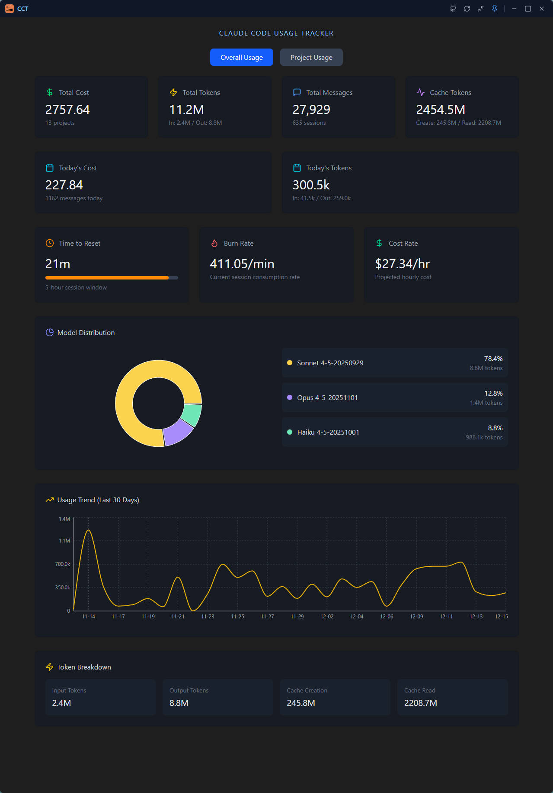
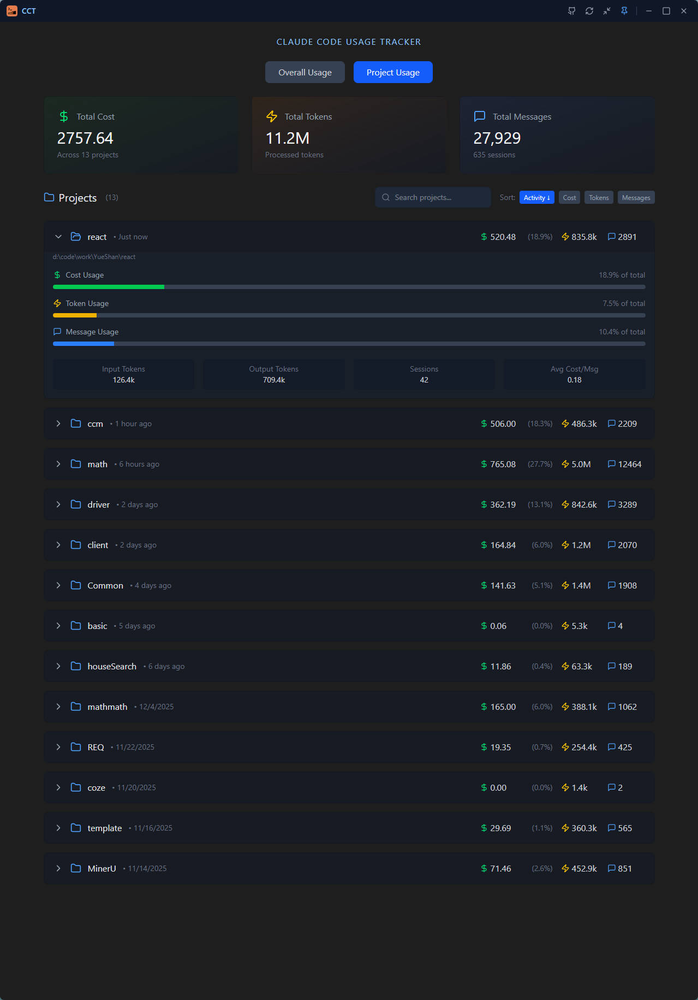
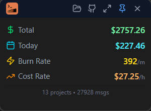
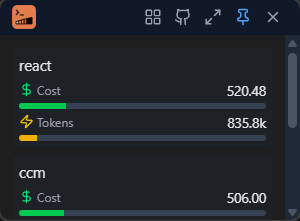

# Claude Code Usage Tracker

A desktop application for tracking Claude Code usage statistics, built with Tauri, React, and Rust.

[中文文档](./README_CN.md)

## Features

- **Real-time Usage Tracking**: Monitor token usage, costs, and message counts across all your Claude Code projects
- **Today's Statistics**: View daily usage since local midnight with timezone-aware calculations
- **Project-level Analytics**: Break down usage by individual projects with detailed statistics
- **Burn Rate Monitoring**: Track your current session's token consumption rate and projected hourly costs
- **Model Distribution**: Visualize usage across different Claude models with interactive pie charts
- **Usage Trends**: View historical usage patterns with 30-day trend charts
- **Compact Mode**: Minimal floating window for always-on-top monitoring without disrupting your workflow
- **Session Window Tracking**: Monitor the 5-hour rolling session window with time-to-reset countdown

## Screenshots

### Normal Mode

#### Overall Statistics


#### Projects View


### Compact Mode

#### Compact Overall View


#### Compact Projects View


## Installation

### Download Pre-built Binaries

Download the latest release for your platform from the [Releases](https://github.com/LyndonWangWork/Claude-Code-Usage-Tracker/releases) page.

| Platform              | Format              |
| --------------------- | ------------------- |
| Windows               | `.msi`, `.exe`      |
| macOS (Intel)         | `.dmg`              |
| macOS (Apple Silicon) | `.dmg`              |
| Linux                 | `.deb`, `.AppImage` |

### Build from Source

#### Prerequisites

- Node.js 20+
- Rust (stable)
- Tauri CLI

#### Setup

```bash
# Clone the repository
git clone https://github.com/LyndonWangWork/Claude-Code-Usage-Tracker.git
cd Claude-Code-Usage-Tracker

# Install frontend dependencies
cd web
npm install

# Run development server
cd ..
npm run tauri dev
```

#### Build

```bash
npm run tauri build
```

## Usage

1. **Launch the application** - The app will automatically detect your Claude Code data directory
2. **View Overall Statistics** - See total costs, tokens, messages, and session metrics
3. **Browse Projects** - Switch to the Projects tab to see per-project breakdowns
4. **Toggle Compact Mode** - Click the compact button to switch to a compact floating window
5. **Pin to Top** - Use the pin button to keep the window always on top

## Data Source

The application reads usage data from Claude Code's local storage:
- **Default location**: `~/.claude/projects/`
- **Custom location**: Set via `CLAUDE_CONFIG_DIR` environment variable

## Release

Releases are automated via GitHub Actions. To create a new release:

1. Update version in `src-tauri/tauri.conf.json` and `src-tauri/Cargo.toml`
2. Commit the version changes
3. Create and push a version tag:
   ```bash
   git tag v0.1.0
   git push origin v0.1.0
   ```
4. GitHub Actions will automatically build for all platforms
5. A draft release will be created with the build artifacts
6. Review the draft release and publish when ready

## Tech Stack

- **Frontend**: React, TypeScript, Tailwind CSS, Recharts
- **Backend**: Rust, Tauri v2
- **Build**: Vite, Cargo

## Acknowledgements

Special thanks to the [Claude Code Usage Monitor](https://github.com/Maciek-roboblog/Claude-Code-Usage-Monitor) project by Maciek-roboblog for inspiration and reference implementation.

